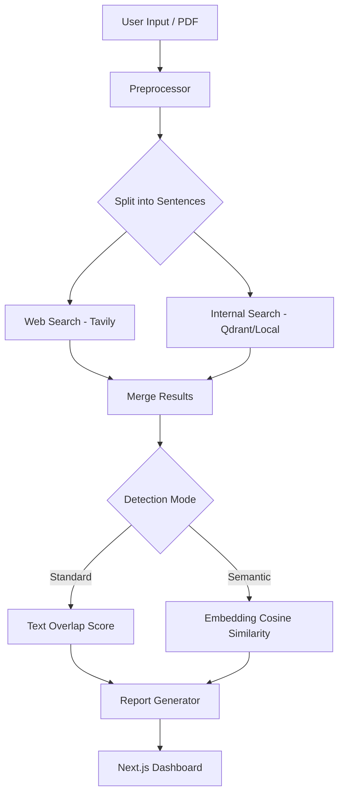

# 🛡️ AI-Powered Semantic Plagiarism Checker

[](https://nextjs.org/)
[](https://fastapi.tiangolo.com/)
[](https://tavily.com/)
[](https://huggingface.co/sentence-transformers/all-MiniLM-L6-v2)

A professional-grade plagiarism detection system that goes beyond simple keyword matching. By combining **Exact Text Overlap** analysis with **AI-driven Semantic Embeddings**, this tool identifies both direct copies and sophisticated paraphrasing across the live web.

---

## ✨ Key Features

### 🧠 Dual-Mode Detection Engine
- **Standard Mode**: Utilizes `difflib` and token-level comparison to detect exact string matches and minor edits.
- **Semantic Mode**: Leverages `Sentence Transformers` (`all-MiniLM-L6-v2`) to compute high-dimensional vector similarities, catching paraphrased content that traditional checkers miss.

### 🌐 Live Web Intelligence
- Integrated with the **Tavily Search API** for real-time internet scanning.
- Concurrent sentence analysis for rapid results.
- Retrieves source URLs, page titles, and relevant snippets for detailed reporting.

### 📄 Comprehensive Document Support
- **Direct Uploads**: Supports `.pdf` and `.txt` file processing with automated text extraction.
- **Internal Database**: Index and search against your own local repository of documents.

### 🎨 Premium User Experience
- **Modern Dark UI**: A sleek, glassmorphism-inspired design built with Next.js.
- **Interactive Reports**: Circular risk gauges, real-time scanning progress, and detailed match breakdowns.
- **Risk Assessment**: Intelligent scoring logic that categorizes results from "Low" to "Very High" risk.

---

## 🏗️ Technical Architecture



---

## 🚀 Quick Start

### 1. Backend Configuration
The backend is powered by FastAPI and requires Python 3.9+.

```bash
cd backend

# Environment Setup
python3 -m venv venv
source venv/bin/activate

# Dependencies
pip install -r requirements.txt

# API Configuration
# Create a .env file and add your Tavily API Key
echo "TAVILY_API_KEY=your_key_here" > .env
```

### 2. Frontend Development
Built with Next.js 15 for a high-performance interactive experience.

```bash
cd frontend

# Install packages
npm install

# Launch Dev Server
npm run dev
```

### 3. Access the Dashboard
The application will be available at [http://localhost:3000](http://localhost:3000). The backend runs on port `8000` by default.

---

## 🔧 Environment Variables

| Variable | Description | Source |
|----------|-------------|--------|
| `TAVILY_API_KEY` | Required for web search functionality. | [tavily.com](https://tavily.com) |
| `DATABASE_URL` | Optional: PostgreSQL/SQLite for history. | |
| `MODEL_NAME` | Defaults to `all-MiniLM-L6-v2`. | HuggingFace |

---

## ⚖️ Notes & Limitations
- **Model Loading**: The first run will download the ~80MB embedding model (~30-60s depending on connection).
- **Search Limits**: Results are limited by your Tavily API tier (Free tier allows 1,000 searches/month).
- **Sentence Filtering**: To optimize API usage, only the most content-rich sentences are analyzed for long documents.

---

## 📄 License
Created for educational and research purposes. Check `details.md` for more technical depth.
